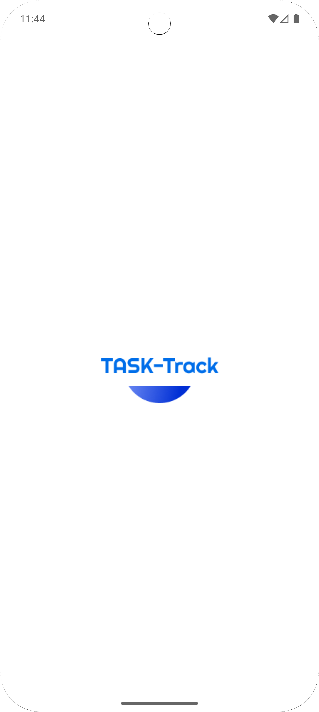
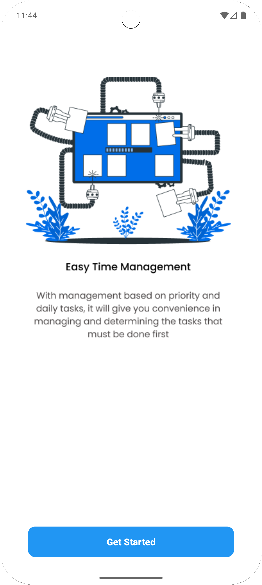
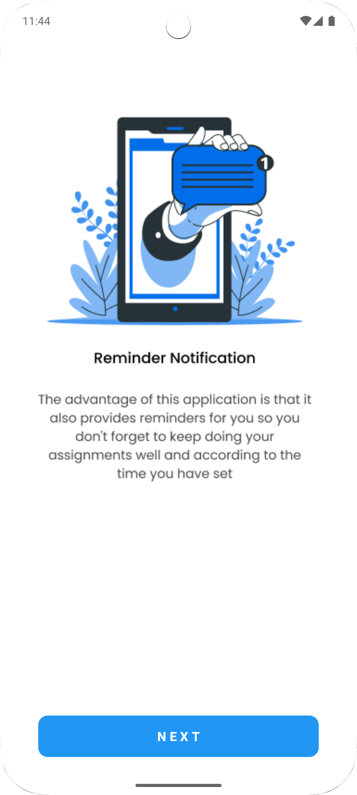
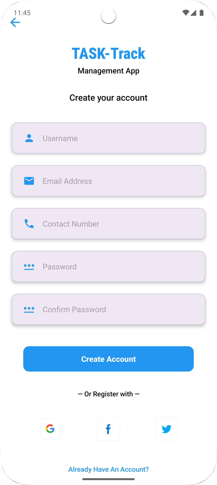
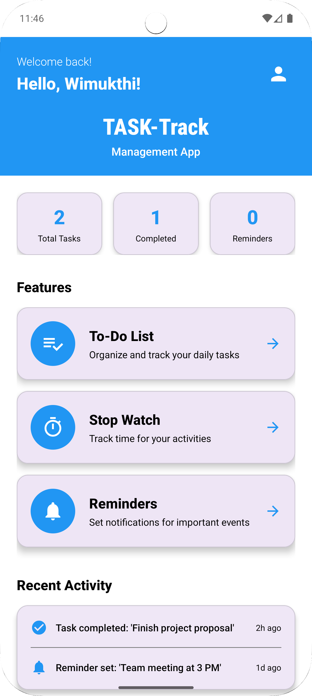
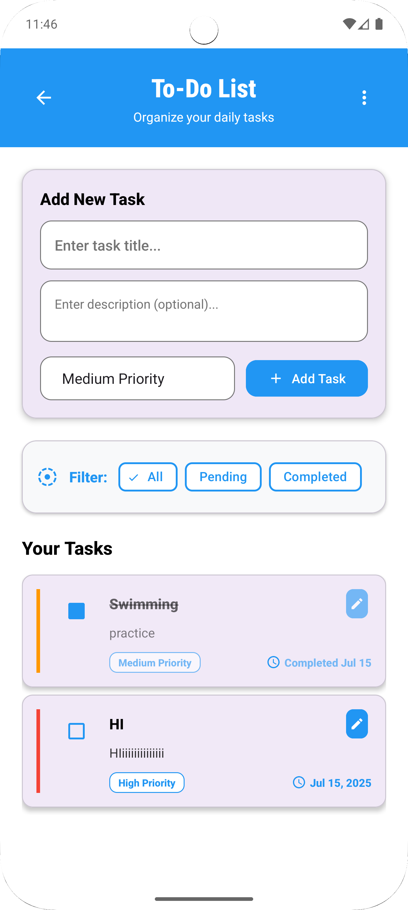
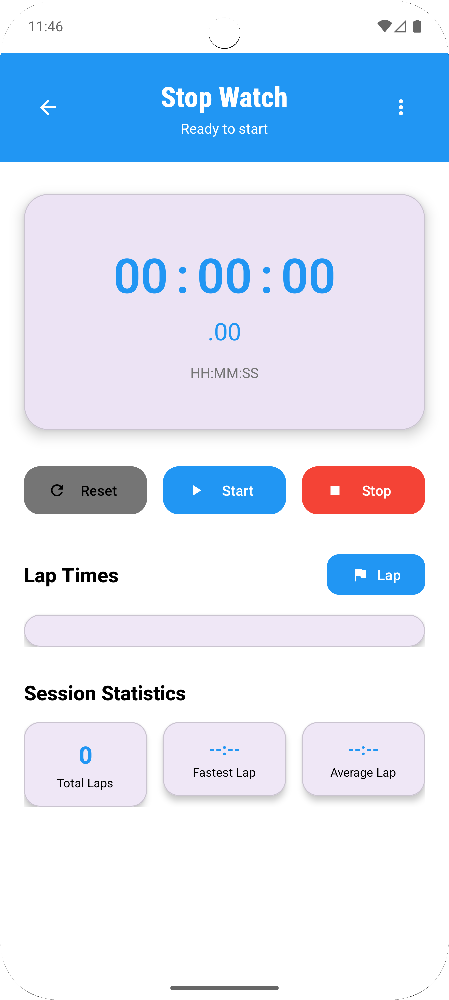
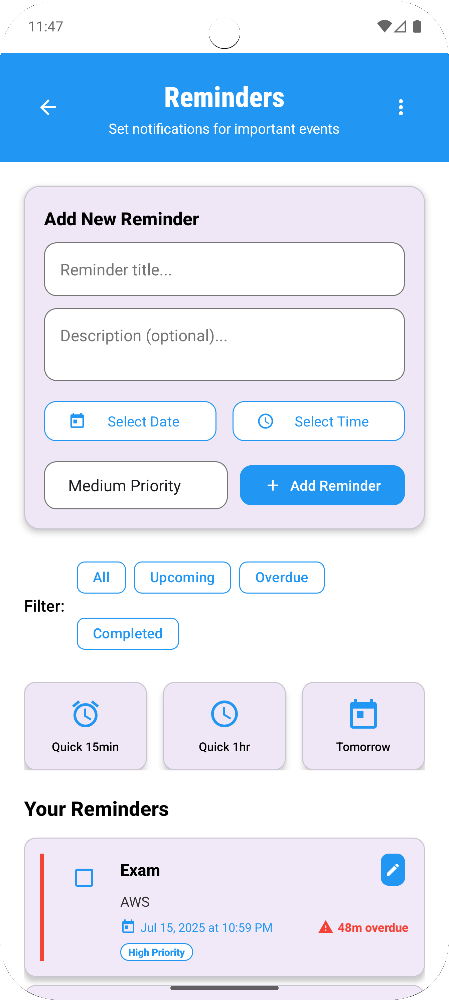
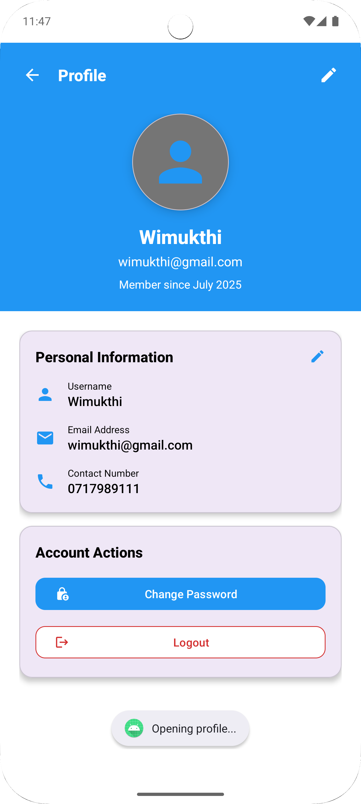
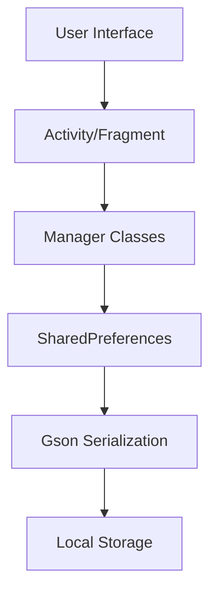

<div align="center">
  
# 📱 TASK-Track
### *Modern Task Management & Productivity App*

[](https://developer.android.com)
[](https://kotlinlang.org)
[](https://android-arsenal.com/api?level=21)
[](LICENSE)

*Stay organized, boost productivity, and never miss important tasks with TASK-Track - your all-in-one productivity companion.*

</div>

---

## 🌟 **Features Overview**

<div align="center">

| 📋 **Task Management** | ⏱️ **Time Tracking** | 🔔 **Smart Reminders** | 👤 **User Profiles** |
|:---:|:---:|:---:|:---:|
| Create, organize & prioritize tasks | Built-in stopwatch with lap times | Set notifications for important events | Secure user authentication |

</div>

### ✨ **Core Features**

- 🎯 **Priority-Based Task Management** - Organize tasks by High, Medium, and Low priority
- ⏰ **Smart Time Tracking** - Built-in stopwatch with lap timing and session statistics
- 🔔 **Intelligent Reminders** - Set custom notifications with quick action shortcuts
- 📊 **Real-Time Analytics** - Track your productivity with live statistics
- 🌅 **Time-Aware Greetings** - Personalized experience based on time of day
- 🔐 **Secure Authentication** - User registration with multiple login options
- 📱 **Modern UI/UX** - Clean, intuitive design with Material Design principles

---

## 📸 **App Screenshots**

### 🚀 **Onboarding & Authentication**
<div align="center">
  
  
  
  
</div>

*Experience smooth onboarding with beautiful illustrations and easy account creation*

### 🏠 **Dashboard & Core Features**
<div align="center">
  
  
  
  
</div>

*Personalized dashboard with real-time statistics and seamless navigation*

### 👤 **User Profile**
<div align="center">
  
</div>

*Comprehensive user profile management with account settings*

---

## 🛠️ **Tech Stack**

<div align="center">

| **Frontend** | **Backend** | **Tools & Libraries** |
|:---:|:---:|:---:|
|  |  |  |
|  |  |  |

</div>

### 🔧 **Key Technologies**
- **Language**: Kotlin
- **UI Framework**: Android Views with Material Design Components
- **Data Storage**: SharedPreferences with Gson serialization
- **Architecture**: MVVM pattern with proper separation of concerns
- **Navigation**: Intent-based navigation with proper lifecycle management

---

## 🚀 **Getting Started**

### 📋 **Prerequisites**
- Android Studio Arctic Fox (2020.3.1) or later
- Android SDK API level 21 or higher
- Kotlin 1.5.0 or later

### 🔧 **Installation**

1. **Clone the repository**
   ```bash
   git clone https://github.com/Wimukthi316/Task-Track.git
   cd Task-Track
   ```

2. **Open in Android Studio**
   - Launch Android Studio
   - Select "Open an existing Android Studio project"
   - Navigate to the cloned directory and open it

3. **Sync dependencies**
   ```bash
   ./gradlew sync
   ```

4. **Run the app**
   - Connect your Android device or start an emulator
   - Click the "Run" button in Android Studio or use:
   ```bash
   ./gradlew installDebug
   ```

---

## 📱 **App Architecture**

### 🏗️ **Project Structure**
```
app/
├── src/main/java/com/example/task_tacker/
│   ├── adapters/           # RecyclerView adapters
│   ├── models/            # Data models (Task, Reminder, User)
│   ├── utils/             # Utility classes (Managers, Preferences)
│   ├── activities/        # App screens and activities
│   └── MainActivity.kt    # Entry point
├── res/
│   ├── layout/           # XML layout files
│   ├── drawable/         # Icons and graphics
│   ├── values/           # Colors, strings, styles
│   └── xml/              # App configurations
└── Task_track_IMG/       # App screenshots
```

### 🔄 **Data Flow**


---

## ✨ **Key Features Breakdown**

### 📋 **Task Management**
- ✅ Create tasks with title, description, and priority levels
- 🔄 Real-time task status updates (Pending/Completed)
- 📊 Filter tasks by status (All, Pending, Completed)
- 📈 Live statistics tracking

### ⏱️ **Stopwatch & Time Tracking**
- ⏰ Precision timing with millisecond accuracy
- 🏃 Lap time recording with session statistics
- 📊 Fastest and average lap calculations
- 🎮 Intuitive controls (Start, Stop, Reset, Lap)

### 🔔 **Smart Reminders**
- 📅 Date and time selection with custom scheduling
- ⚡ Quick action shortcuts (15min, 1hr, Tomorrow)
- 🚨 Priority-based reminder categorization
- 📱 Overdue notification tracking

### 👤 **User Management**
- 🔐 Secure user registration and authentication
- 📝 Profile management with editable information
- 🌅 Time-aware personalized greetings
- 🔄 Session persistence and logout functionality

---

## 📊 **Performance Highlights**

<div align="center">

| **Metric** | **Value** | **Description** |
|:---:|:---:|:---|
| 🚀 **App Size** | < 10MB | Lightweight and efficient |
| ⚡ **Load Time** | < 2 seconds | Fast startup and navigation |
| 🔋 **Battery Usage** | Minimal | Optimized background processing |
| 📱 **Compatibility** | API 21+ | Supports 95%+ Android devices |

</div>

---

## 🎨 **Design Philosophy**

### 🎯 **User Experience**
- **Intuitive Navigation**: Clean, material design interface
- **Accessibility**: Proper contrast ratios and touch targets
- **Responsive Design**: Optimized for various screen sizes
- **Consistent Theming**: Unified color scheme and typography

### 🔄 **Development Practices**
- **Clean Code**: Well-structured, maintainable codebase
- **Error Handling**: Graceful failure recovery
- **Data Persistence**: Reliable local storage solutions
- **Performance**: Optimized for smooth user experience

---

## 🤝 **Contributing**

We welcome contributions! Here's how you can help:

1. **🍴 Fork the repository**
2. **🌿 Create a feature branch**
   ```bash
   git checkout -b feature/amazing-feature
   ```
3. **💻 Commit your changes**
   ```bash
   git commit -m 'Add amazing feature'
   ```
4. **📤 Push to the branch**
   ```bash
   git push origin feature/amazing-feature
   ```
5. **🔄 Open a Pull Request**

### 📝 **Contribution Guidelines**
- Follow Kotlin coding conventions
- Write meaningful commit messages
- Update documentation for new features
- Test your changes thoroughly

---

## 👨‍💻 **Developer**

<div align="center">

### **Wimukthi316**
*Full-Stack / Android Developer / Data Engineer / DevOps*

[](https://github.com/Wimukthi316)
[](mailto:wimukthi@gmail.com)

*"Building efficient, user-friendly mobile applications that enhance productivity and simplify daily life."*

</div>

---

<div align="center">

### 🌟 **Star this repository if you found it helpful!**

**Made with ❤️ by [Wimukthi316](https://github.com/Wimukthi316)**

*Last updated: July 16, 2025*

</div>
